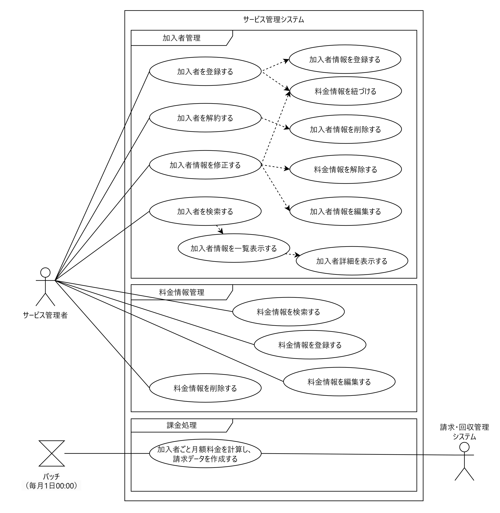
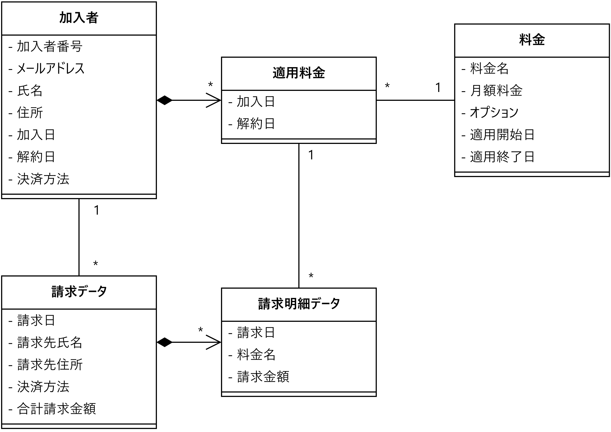
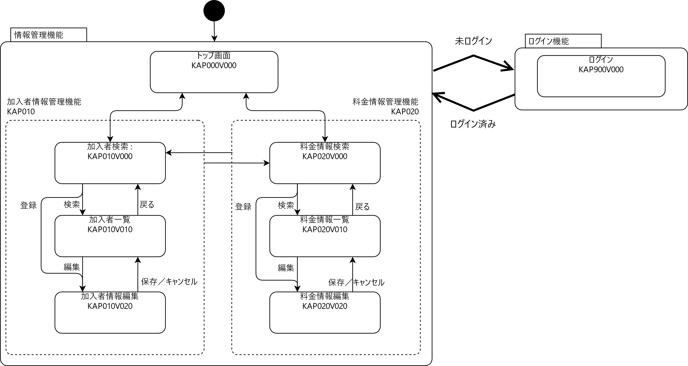
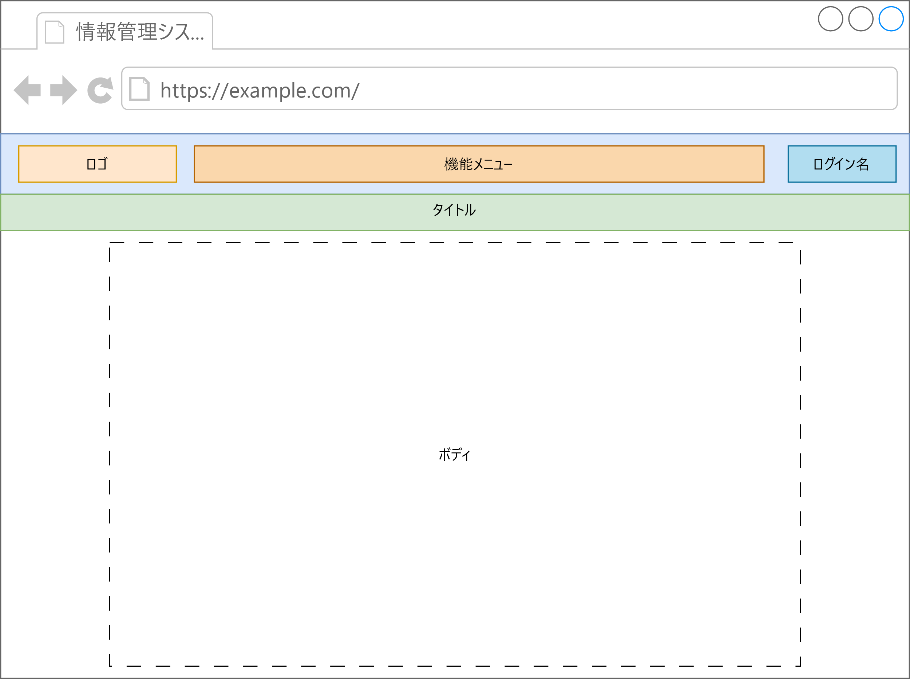
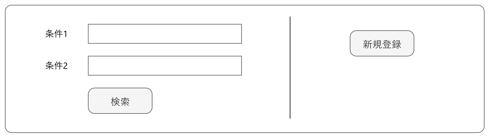
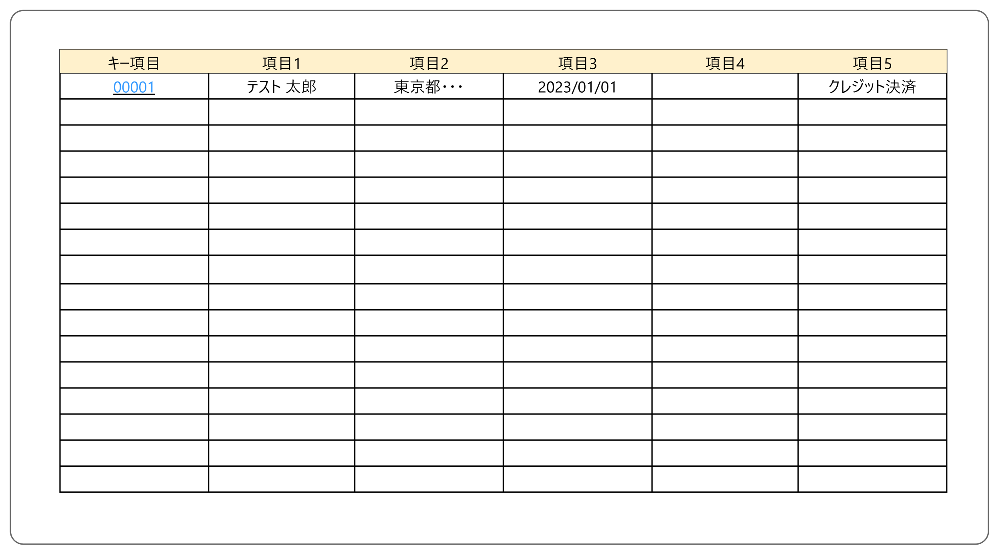
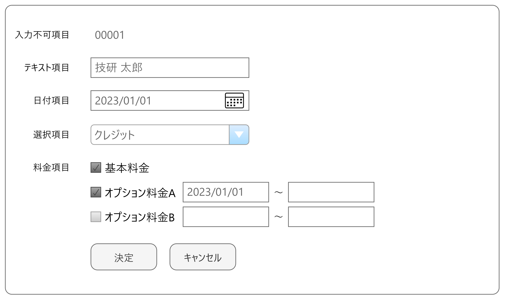
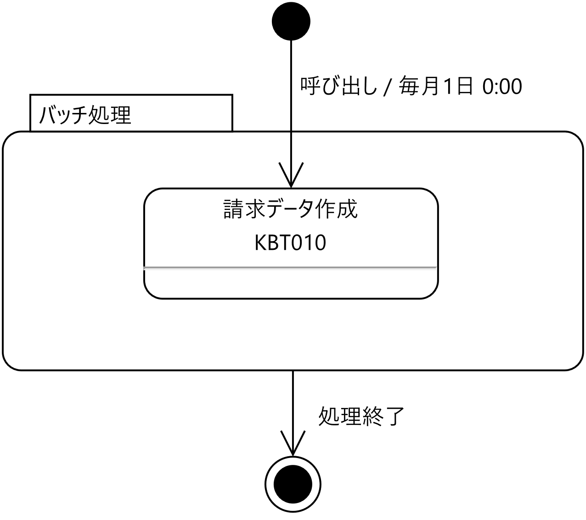
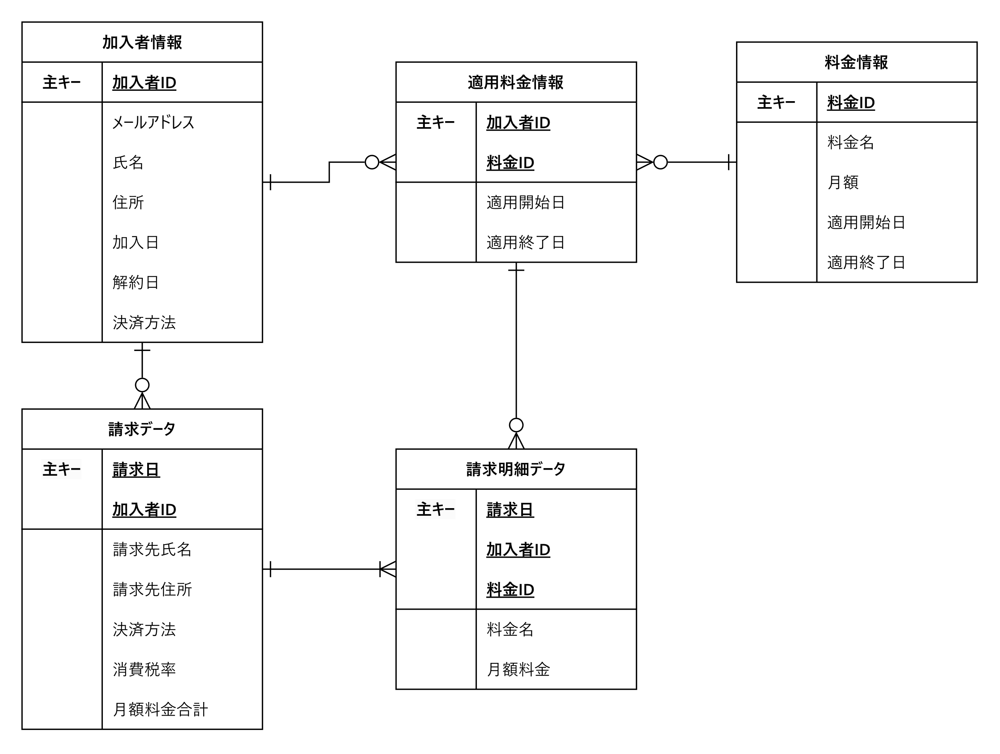

# 基本設計

## ユースケース

### 加入者情報管理機能

<table>
<colgroup>
<col style="width: 21%" />
<col style="width: 78%" />
</colgroup>
<thead>
<tr class="header">
<th>ユースケース名</th>
<th>加入者を登録する</th>
</tr>
</thead>
<tbody>
<tr class="odd">
<td>主アクター</td>
<td>管理者</td>
</tr>
<tr class="even">
<td>事前条件</td>
<td>登録対象が灯篭されていないこと</td>
</tr>
<tr class="odd">
<td>主シナリオ</td>
<td><ol type="1">
<li>
管理者は、加入者登録画面を表示する
</li>
<li>
サービス管理システムは、加入者登録画面を表示する
</li>
<li>
管理者は加入者情報を登録する。
</li>
<li>
サービス管理システムは、加入者情報を保存する
</li>
<li>
管理者は、加入者情報を確認する
</li>
</ol></td>
</tr>
<tr class="even">
<td>拡張シナリオ</td>
<td>4a. サービス管理システムは入力エラーを表示する</td>
</tr>
<tr class="odd">
<td>成功時保障</td>
<td>加入者情報がデータベースに登録される</td>
</tr>
</tbody>
</table>

<table>
<colgroup>
<col style="width: 21%" />
<col style="width: 78%" />
</colgroup>
<thead>
<tr class="header">
<th>ユースケース名</th>
<th>加入者を編集する</th>
</tr>
</thead>
<tbody>
<tr class="odd">
<td>主アクター</td>
<td>管理者</td>
</tr>
<tr class="even">
<td>事前条件</td>
<td>加入者情報が登録済みであること</td>
</tr>
<tr class="odd">
<td>主シナリオ</td>
<td><ol type="1">
<li>
管理者は、加入者情報を検索する
</li>
<li>
サービス管理システムは、加入者情報の一覧を名前基準に昇順で表示する。
</li>
<li>
管理者は、一覧から対象の加入者を選択する。
</li>
<li>
サービス管理システムは加入者情報を表示する。
</li>
<li>
管理者は、加入者情報を修正する。
</li>
<li>
サービス管理システムは、加入者情報を保存する。
</li>
<li>
管理者は、加入者情報を確認する
</li>
</ol></td>
</tr>
<tr class="even">
<td>拡張シナリオ</td>
<td>6a. サービス管理システムは入力エラーを表示する</td>
</tr>
<tr class="odd">
<td>成功時保障</td>
<td>加入者情報が更新される</td>
</tr>
</tbody>
</table>

<table>
<colgroup>
<col style="width: 21%" />
<col style="width: 78%" />
</colgroup>
<thead>
<tr class="header">
<th>ユースケース名</th>
<th>加入者をする</th>
</tr>
</thead>
<tbody>
<tr class="odd">
<td>主アクター</td>
<td>管理者</td>
</tr>
<tr class="even">
<td>事前条件</td>
<td>加入者情報が登録済みであること</td>
</tr>
<tr class="odd">
<td>主シナリオ</td>
<td><ol type="1">
<li>
管理者は、加入者情報を検索する
</li>
<li>
サービス管理システムは、加入者情報の一覧を名前基準に昇順で表示する。
</li>
<li>
管理者は、一覧から対象の加入者を選択する。
</li>
<li>
サービス管理システムは加入者情報を表示する。
</li>
<li>
管理者は、加入者情報を削除する。
</li>
<li>
サービス管理システムは、加入者情報を保存する。
</li>
<li>
管理者は、加入者情報を確認する
</li>
</ol></td>
</tr>
<tr class="even">
<td>拡張シナリオ</td>
<td>6a. サービス管理システムは入力エラーを表示する</td>
</tr>
<tr class="odd">
<td>成功時保障</td>
<td>加入者情報が削除される</td>
</tr>
</tbody>
</table>

### 料金管理機能

<table>
<colgroup>
<col style="width: 21%" />
<col style="width: 78%" />
</colgroup>
<thead>
<tr class="header">
<th>ユースケース名</th>
<th>料金情報を登録する</th>
</tr>
</thead>
<tbody>
<tr class="odd">
<td>主アクター</td>
<td>管理者</td>
</tr>
<tr class="even">
<td>事前条件</td>
<td>登録対象が灯篭されていないこと</td>
</tr>
<tr class="odd">
<td>主シナリオ</td>
<td><ol type="1">
<li>
管理者は、基本料金登録画面を表示する
</li>
<li>
サービス管理システムは、基本料金登録画面を表示する
</li>
<li>
管理者は料金情報を登録する。
</li>
<li>
サービス管理システムは、料金情報を保存する
</li>
<li>
管理者は、料金情報を確認する
</li>
</ol></td>
</tr>
<tr class="even">
<td>拡張シナリオ</td>
<td>4a. サービス管理システムは入力エラーを表示する</td>
</tr>
<tr class="odd">
<td>成功時保障</td>
<td>料金情報がデータベースに登録される</td>
</tr>
</tbody>
</table>

<table>
<colgroup>
<col style="width: 21%" />
<col style="width: 78%" />
</colgroup>
<thead>
<tr class="header">
<th>ユースケース名</th>
<th>加入者情報を編集する</th>
</tr>
</thead>
<tbody>
<tr class="odd">
<td>主アクター</td>
<td>管理者</td>
</tr>
<tr class="even">
<td>事前条件</td>
<td>加入者情報が登録済みであること</td>
</tr>
<tr class="odd">
<td>主シナリオ</td>
<td><ol type="1">
<li>
管理者は、料金情報を検索する
</li>
<li>
サービス管理システムは、料金情報の一覧を名前基準に昇順で表示する。
</li>
<li>
管理者は、一覧から対象の基本料金を選択する。
</li>
<li>
サービス管理システムは料金情報を表示する。
</li>
<li>
管理者は、料金情報を修正する。
</li>
<li>
サービス管理システムは、料金情報を保存する。
</li>
<li>
管理者は、料金情報を確認する
</li>
</ol></td>
</tr>
<tr class="even">
<td>拡張シナリオ</td>
<td>6a. サービス管理システムは入力エラーを表示する</td>
</tr>
<tr class="odd">
<td>成功時保障</td>
<td>料金情報が更新される</td>
</tr>
</tbody>
</table>

<table>
<colgroup>
<col style="width: 21%" />
<col style="width: 78%" />
</colgroup>
<thead>
<tr class="header">
<th>ユースケース名</th>
<th>料金情報を削除する</th>
</tr>
</thead>
<tbody>
<tr class="odd">
<td>主アクター</td>
<td>管理者</td>
</tr>
<tr class="even">
<td>事前条件</td>
<td>料金情報が登録済みであること</td>
</tr>
<tr class="odd">
<td>主シナリオ</td>
<td><ol type="1">
<li>
管理者は、料金情報を検索する
</li>
<li>
サービス管理システムは、料金情報の一覧を名前基準に昇順で表示する。
</li>
<li>
管理者は、一覧から対象の基本料金を選択する。
</li>
<li>
サービス管理システムは料金情報を表示する。
</li>
<li>
管理者は、料金情報を削除する。
</li>
<li>
サービス管理システムは、料金情報を保存する。
</li>
</ol></td>
</tr>
<tr class="even">
<td>拡張シナリオ</td>
<td>6a. サービス管理システムは入力エラーを表示する</td>
</tr>
<tr class="odd">
<td>成功時保障</td>
<td>加入者情報が削除される</td>
</tr>
</tbody>
</table>

### 請求データ作成機能

<table>
<colgroup>
<col style="width: 21%" />
<col style="width: 78%" />
</colgroup>
<thead>
<tr class="header">
<th>ユースケース名</th>
<th>請求データを作成する</th>
</tr>
</thead>
<tbody>
<tr class="odd">
<td>主アクター</td>
<td>サービス管理システム</td>
</tr>
<tr class="even">
<td>事前条件</td>
<td>このユースケースは毎月1日に1回実行されること</td>
</tr>
<tr class="odd">
<td>主シナリオ</td>
<td><ol type="1">
<li>
サービス管理システムは、加入者ごと基本料金と追加オプション料金を集計し、請求データを作成する。
</li>
<li>
請求データおよび請求明細データテーブルにトランザクションとしてレコード追加する。
</li>
<li>
サービス管理システムはトランザクションを確定する。
</li>
</ol></td>
</tr>
<tr class="even">
<td>拡張シナリオ</td>
<td>2a. 処理中にエラーが発生した場合は中断し、トランザクションを破棄する。</td>
</tr>
<tr class="odd">
<td>成功時保障</td>
<td>当月分の請求データおよび請求明細データが作成される</td>
</tr>
</tbody>
</table>

## 概念モデル

ソース：[Java 研修.drawio](https://sgiken365-my.sharepoint.com/:u:/g/personal/ooshima_s-giken_com/Ea9zT-NOwGpBlvgb5fFbQzIBi0iTYcZgAMtMoeQRBtbiRA?e=YLqOEB) → 概念モデルシート

# 外部設計

## サービス管理システムの関係性

- 全ての情報は、サービス管理データベース(K_SRVMAN)の各テーブルに格納される。
- データの閲覧、登録、修正は「サービス管理アプリケーション(KAP)」にて行う。
- 月次、日次など定期的に行う一括処理は「サービス管理バッチ処理(KBT)」にて行う。

## サービス管理アプリケーションのフロー

- 未ログインの場合は、各画面を表示する前にログイン画面を表示する。
- 画面上部の機能メニューからトップ画面や各情報の検索画面へ遷移できる。なお、画面に入力したデータは、画面が遷移するとすべて失われる。

## UI 設計ポリシー

### 前提条件

本システムのクライアントには Web ブラウザを用いる。

| 対応ブラウザ     | 最新の Microsoft Edge、Google Chrome、Firefox |
| ---------------- | --------------------------------------------- |
| 画面レイアウト幅 | ブラウザに合わせて可変とする。                |
| 文字コード       | UTF-8                                         |

### 画面レイアウト

本システムの画面レイアウトは、次の通りとする。(背景色は領域を表す)

| ヘッダー     | システムロゴ、機能メニュー、ログイン名を表示します |
| ------------ | -------------------------------------------------- |
| 機能メニュー | 各機能へのリンク                                   |
| タイトル     | 機能のタイトルを表示                               |
| ボディ       | 各機能のコンテンツやフォームを表示します           |

### 画面機能レイアウトパターン

| 検索条件入力画面 | 情報を検索する際の条件を入力する画面パターン |
| ---------------- | -------------------------------------------- |
| 検索結果一覧画面 | 情報の検索結果を一覧で表示する画面パターン   |
| 情報編集画面     | 情報を編集する画面パターン                   |

#### 検索条件入力画面

- 左側に検索条件としたい項目を、項目名と入力欄でセットとして、1 セットずつ表示し、最後に検索ボタンを表示する。
- 右側に、新規登録ボタンを配置する。

#### 検索結果一覧画面

- 検索条件に一致する結果から、表示する項目を 1 レコードずつ表形式で表示する。
- キーとなる項目をクリックすることで、その情報の編集画面を表示できるようにする。

#### 情報編集画面

- 編集対象となる情報の項目を、項目名と適切な入力欄とセットにして、1 行に 1 セット表示する。

- 最後の行に、「保存」ボタンと「キャンセル」ボタンを表示する。

### 項目パターン

本システム内で使用される情報の各項目における入力時、表示時の取扱いについては次の通りとする。

<table>
<colgroup>
<col style="width: 19%" />
<col style="width: 8%" />
<col style="width: 71%" />
</colgroup>
<tbody>
<tr class="odd">
<td rowspan="2">加入者番号</td>
<td>入力</td>
<td>テキストで入力する</td>
</tr>
<tr class="even">
<td>表示</td>
<td>テキストで表示する</td>
</tr>
<tr class="odd">
<td rowspan="2">メールアドレス</td>
<td>入力</td>
<td>テキストで入力する</td>
</tr>
<tr class="even">
<td>表示</td>
<td>テキストで表示する</td>
</tr>
<tr class="odd">
<td rowspan="2">氏名</td>
<td>入力</td>
<td>テキストで入力する</td>
</tr>
<tr class="even">
<td>表示</td>
<td>テキストで表示する</td>
</tr>
<tr class="odd">
<td rowspan="2">住所</td>
<td>入力</td>
<td>都道府県、市町村、番地、建物等をまとめてテキストで入力する</td>
</tr>
<tr class="even">
<td>表示</td>
<td>テキストで入力する</td>
</tr>
<tr class="odd">
<td rowspan="2">加入日</td>
<td>入力</td>
<td>テキスト入力または、カレンダーピックで入力する</td>
</tr>
<tr class="even">
<td>表示</td>
<td>テキストで表示する</td>
</tr>
<tr class="odd">
<td rowspan="2">解約日</td>
<td>入力</td>
<td>テキスト入力または、カレンダーピックで入力する</td>
</tr>
<tr class="even">
<td>表示</td>
<td>YYYY/MM/DD形式のテキストで表示する</td>
</tr>
<tr class="odd">
<td rowspan="2">決済方法</td>
<td>入力</td>
<td>
チェックボックスのリストで入力する。

オプション料金は併せて、適用開始日と適用終了日をテキストまたは、カレンダーピックで入力する。

</td>
</tr>
<tr class="even">
<td>表示</td>
<td>テキストで表示する</td>
</tr>
<tr class="odd">
<td rowspan="2">料金番号</td>
<td>入力</td>
<td>テキストで入力する</td>
</tr>
<tr class="even">
<td>表示</td>
<td>テキストで表示する</td>
</tr>
<tr class="odd">
<td rowspan="2">料金名</td>
<td>入力</td>
<td>テキストで入力する</td>
</tr>
<tr class="even">
<td>表示</td>
<td>テキストで表示する</td>
</tr>
<tr class="odd">
<td rowspan="2">月額料金</td>
<td>入力</td>
<td>テキストで入力する。</td>
</tr>
<tr class="even">
<td>表示</td>
<td>3桁カンマ区切りのテキストで表示する。</td>
</tr>
<tr class="odd">
<td rowspan="2">適用開始日</td>
<td>入力</td>
<td>テキスト入力または、カレンダーピックで入力する</td>
</tr>
<tr class="even">
<td>表示</td>
<td>YYYY/MM/DD形式のテキストで表示する</td>
</tr>
<tr class="odd">
<td rowspan="2">適用終了日</td>
<td>入力</td>
<td>テキスト入力または、カレンダーピックで入力する</td>
</tr>
<tr class="even">
<td>表示</td>
<td>YYYY/MM/DD形式のテキストで表示する</td>
</tr>
</tbody>
</table>

### 入力制限一覧

本システム内で使用される情報の各項目における入力時、表示時の取扱いについては次の通りとする。

表 -

| 項目名         | デフォルト | 最小文字数 | 最大文字数 | 利用可能文字             |
| -------------- | ---------- | ---------- | ---------- | ------------------------ |
| メールアドレス | 空欄       | 1          | 256        | メールアドレス           |
| 氏名           | 空欄       | 1          | 20         | 半角英字、全角、スペース |
| 住所           | 空欄       | 1          | 128        | 半角英字、全角、スペース |
| 加入日         | 空欄       | 10         | 10         | 半角数字、スラッシュ     |
| 解約日         | 空欄       | 10         | 10         | 半角数字、スラッシュ     |
| 決済方法       | 空欄       | ―          | ―          | ―                        |
| 料金名         | 空欄       | 1          | 64         | 半角英字、全角、スペース |
| 料金           | 空欄       | 1          | 12         | 半角数字                 |
| 適用開始日     | 空欄       | 10         | 10         | 半角数字、スラッシュ     |
| 適用終了日     | 空欄       | 10         | 10         | 半角数字、スラッシュ     |

## バッチ設計

本システムのバッチ処理は、次の通りとする。

### バッチ概要

<table>
<colgroup>
<col style="width: 26%" />
<col style="width: 73%" />
</colgroup>
<tbody>
<tr class="odd">
<td>バッチ名</td>
<td>請求データ作成</td>
</tr>
<tr class="even">
<td>機能ID</td>
<td>KBT010</td>
</tr>
<tr class="odd">
<td>実行タイミング</td>
<td>月次（毎月1日0:00）</td>
</tr>
<tr class="even">
<td>トランザクション</td>
<td>追加する請求データおよび請求明細データ</td>
</tr>
<tr class="odd">
<td>バッチ概要</td>
<td>
加入者情報とそれに紐づく適用料金情報、料金情報を参照し、加入者ごとに月額費用を集計、請求データとして登録。

合わせて、集計対象となった料金情報を請求明細データとして登録する。
</td>
</tr>
<tr class="even">
<td>リカバリ概要</td>
<td>問題箇所を修正し、再実行</td>
</tr>
</tbody>
</table>

### ジョブフロー

## データベース設計

### ER 図

### テーブル定義

各テーブルの項目などの定義は、[データベーステーブル設計書.xlsx](データベーステーブル設計書.xlsx)を参照。
