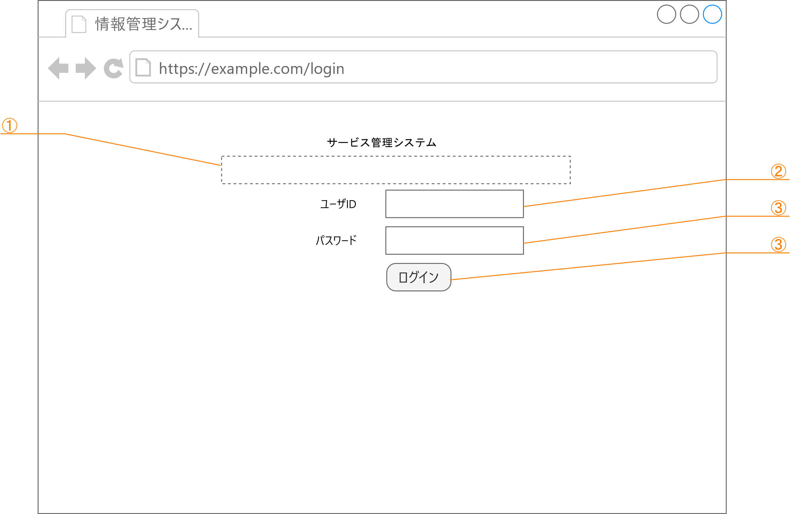
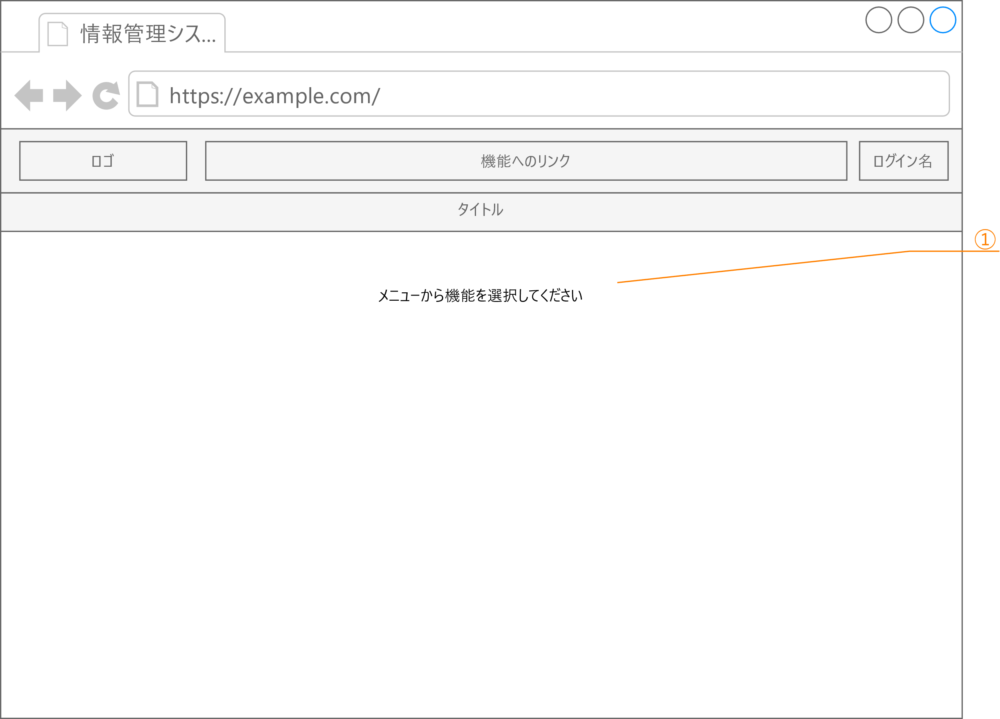
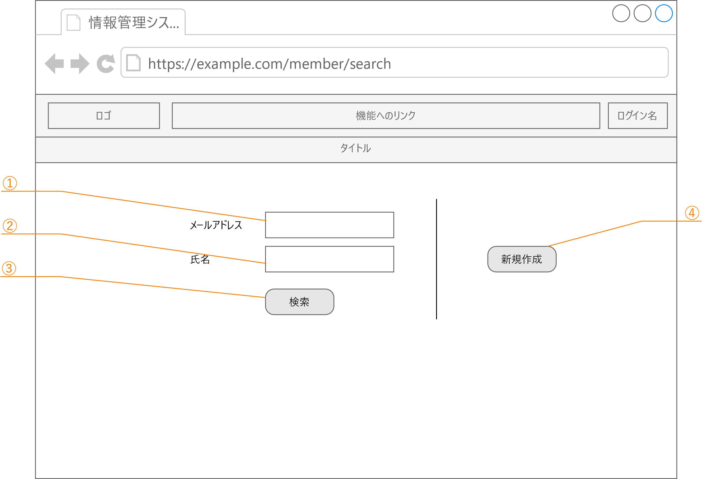
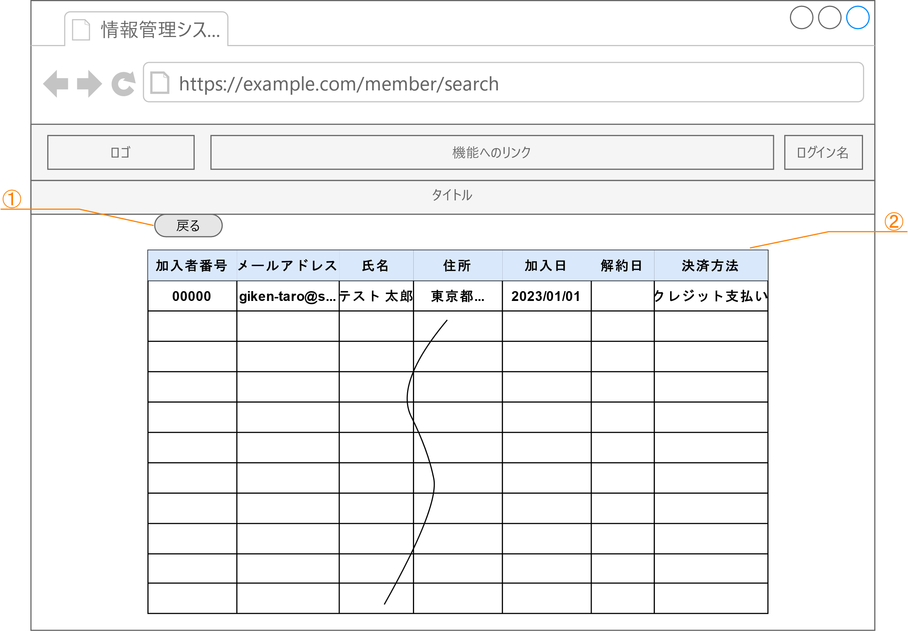
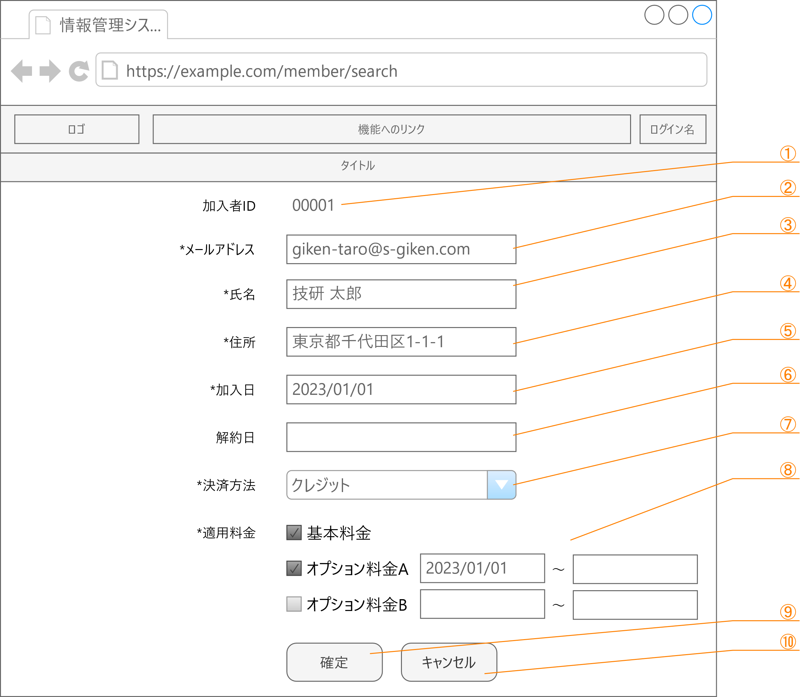
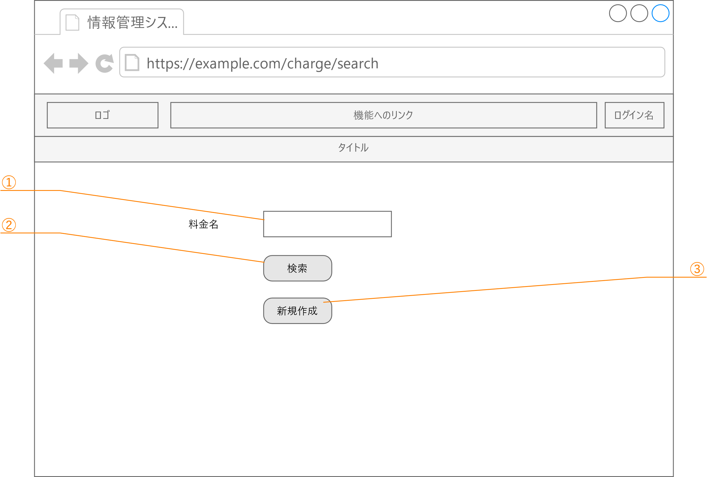
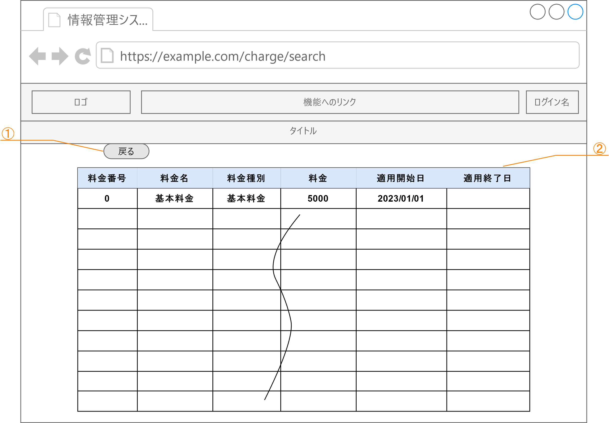
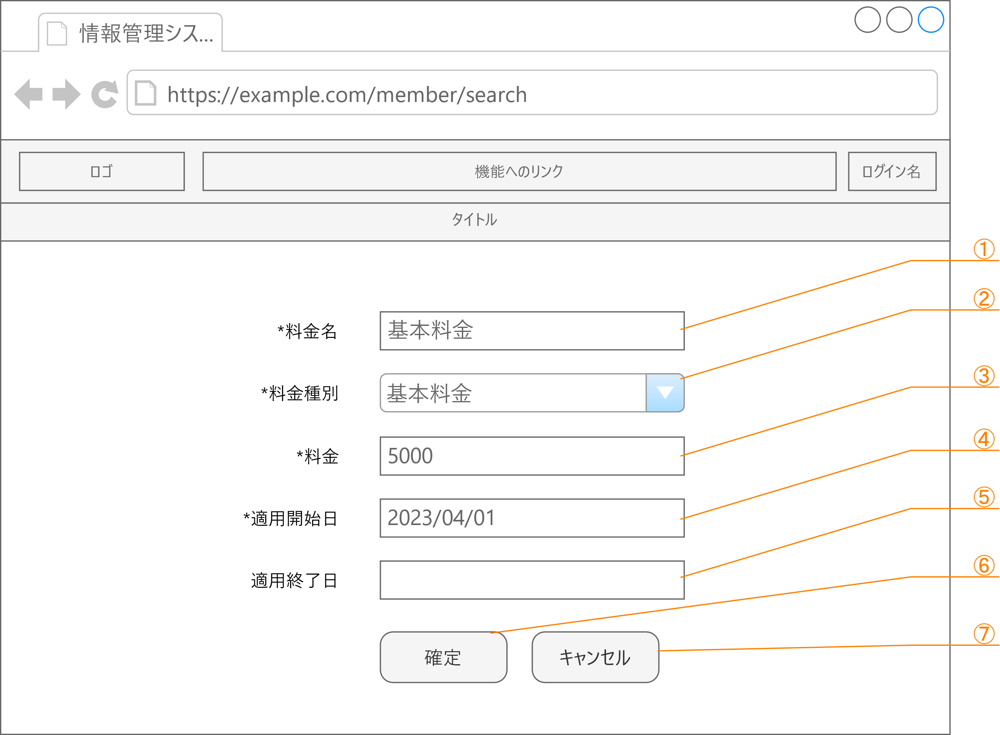

# 画面・機能設計

## ログイン画面

|         |              |
| ------- | ------------ |
| 画面 ID | KAP900V000   |
| 画面名  | ログイン画面 |

### 構成

| No  | 項目 ID  | 項目名     | 項目タイプ | 制限 | 備考 |
| --- | -------- | ---------- | ---------- | ---- | ---- |
| ①   | message  | メッセージ | テキスト   |      |      |
| ②   | userId   | ユーザ ID  | テキスト   |      |      |
| ③   | password | パスワード | パスワード |      |      |
| ④   | login    | ログイン   | ボタン     |      |      |

### イベント・アクション

<table>
<colgroup>
<col style="width: 4%" />
<col style="width: 12%" />
<col style="width: 14%" />
<col style="width: 67%" />
</colgroup>
<thead>
<tr class="header">
<th>No</th>
<th>項目ID</th>
<th>イベント</th>
<th>アクション</th>
</tr>
</thead>
<tbody>
<tr class="odd">
<td>1</td>
<td>login</td>
<td>クリック</td>
<td>
入力された「ユーザID」と「パスワード」をデータベースと照合する。

<ul>
<li>
一致した場合はセッションを確立し、「トップ画面」を表示する。
</li>
<li>
一致しなかった場合は、「message」にログインできなかった旨を表示する。
</li>
</ul></td>
</tr>
</tbody>
</table>

## トップ画面

|         |            |
| ------- | ---------- |
| 画面 ID | KA000V000  |
| 画面名  | トップ画面 |

### 構成

| No  | 項目 ID | 項目名 | 項目タイプ | 制限 | 備考                       |
| --- | ------- | ------ | ---------- | ---- | -------------------------- |
| ①   | ―       | ―      | ラベル     | ―    | 固定メッセージを表示する。 |

### イベント・アクション

※とくになし

## 加入者検索条件画面

|         |                |
| ------- | -------------- |
| 画面 ID | KA010V000      |
| 画面名  | 加入者検索条件 |

### 構成

| No  | 項目 ID    | 項目名         | 項目タイプ | 制限 | 備考 |
| --- | ---------- | -------------- | ---------- | ---- | ---- |
| ①   | mail       | メールアドレス | テキスト   | ―    |      |
| ②   | name       | 氏名           | テキスト   | ―    |      |
| ③   | search     | 検索           | ボタン     | ―    |      |
| ④   | addAccount | 新規作成       | ボタン     | ―    |      |

### イベント・アクション

| No  | 項目 ID    | イベント | アクション                                                                                                       |
| --- | ---------- | -------- | ---------------------------------------------------------------------------------------------------------------- |
| 1   | search     | クリック | 入力された「メールアドレス」と「氏名」を条件に加入者情報を検索した結果を「加入者検索結果一覧画面」として表示す。 |
| 2   | addAccount | クリック | 追加モードで「加入者編集画面」を表示する。                                                                       |

## 加入者検索結果一覧画面

|         |                        |
| ------- | ---------------------- |
| 画面 ID | KA010V010              |
| 画面名  | 加入者検索結果一覧画面 |

### 構成

| No  | 項目 ID | 項目名           | 項目タイプ | 制限/書式  | 備考                                     |
| --- | ------- | ---------------- | ---------- | ---------- | ---------------------------------------- |
| ①   | back    | 戻る             | ボタン     | ―          |                                          |
| ②   | result  | 検索結果一覧     | テーブル   | ―          | 行数制限なし                             |
|     | (項目)  | 　加入者 ID      | リンク     | ―          | クリックすると加入者情報編集画面を表示。 |
|     |         | 　メールアドレス | テキスト   | ―          |                                          |
|     |         | 　氏名           | テキスト   | ―          |                                          |
|     |         | 　住所           | テキスト   | ―          |                                          |
|     |         | 　加入日         | テキスト   | YYYY/MM/DD |                                          |
|     |         | 　解約日         | テキスト   | YYYY/MM/DD |                                          |
|     |         | 　支払方法       | テキスト   | ―          |                                          |

### イベント・アクション

<table>
<colgroup>
<col style="width: 5%" />
<col style="width: 14%" />
<col style="width: 14%" />
<col style="width: 64%" />
</colgroup>
<thead>
<tr class="header">
<th>No</th>
<th>項目ID</th>
<th>イベント</th>
<th>アクション</th>
</tr>
</thead>
<tbody>
<tr class="odd">
<td>1</td>
<td>
result

加入者ID
</td>
<td>クリック</td>
<td>加入者IDに対応する加入者情報の加入者編集画面を表示する。</td>
</tr>
</tbody>
</table>

## 加入者編集画面

|         |                |
| ------- | -------------- |
| 画面 ID | KA010V020      |
| 画面名  | 加入者編集画面 |

### モード

本画面にはモードが存在する。

- 追加モード … 加入者情報と適用料金情報を新たに追加するモード。入力可能な項目はすべて空欄にして表示します。

- 編集モード … 指定された加入者 ID を持つ加入者情報と適用料金情報を編集するモード。加入者 ID に該当する加入者情報と適用料金情報を取得して、入力可能は項目にセットして表示します。

### 構成

<table>
<colgroup>
<col style="width: 4%" />
<col style="width: 15%" />
<col style="width: 18%" />
<col style="width: 18%" />
<col style="width: 20%" />
<col style="width: 21%" />
</colgroup>
<thead>
<tr class="header">
<th>No</th>
<th>項目ID</th>
<th>項目名</th>
<th>項目タイプ</th>
<th>制限/書式</th>
<th>備考</th>
</tr>
</thead>
<tbody>
<tr class="odd">
<td>①</td>
<td>addountId</td>
<td>加入者ID</td>
<td></td>
<td>―</td>
<td></td>
</tr>
<tr class="even">
<td>②</td>
<td>mail</td>
<td>メールアドレス</td>
<td>テキスト</td>
<td></td>
<td></td>
</tr>
<tr class="odd">
<td>③</td>
<td>name</td>
<td>氏名</td>
<td>テキスト</td>
<td>―</td>
<td></td>
</tr>
<tr class="even">
<td>④</td>
<td>address</td>
<td>住所</td>
<td>テキスト</td>
<td>―</td>
<td></td>
</tr>
<tr class="odd">
<td>⑤</td>
<td>joinAt</td>
<td>加入日</td>
<td>日付</td>
<td>YYYY/MM/DD</td>
<td></td>
</tr>
<tr class="even">
<td>⑥</td>
<td>retireAt</td>
<td>解約日</td>
<td>日付</td>
<td>YYYY/MM/DD</td>
<td></td>
</tr>
<tr class="odd">
<td>⑦</td>
<td>chargeMethod</td>
<td>決済方法</td>
<td>ドロップダウン</td>
<td></td>
<td>
クレジット決済

銀行振込

のいずれか
</td>
</tr>
<tr class="even">
<td>⑧</td>
<td>applyAmount</td>
<td>適用料金</td>
<td>※</td>
<td>―</td>
<td></td>
</tr>
<tr class="odd">
<td>⑨</td>
<td>submit</td>
<td>確定</td>
<td>ボタン</td>
<td>―</td>
<td></td>
</tr>
<tr class="even">
<td>⑩</td>
<td>cancel</td>
<td>キャンセル</td>
<td>ボタン</td>
<td>―</td>
<td></td>
</tr>
</tbody>
</table>

#### 運用料金

運用料金は、料金情報からすべての項目を取得して、料金種別に次のように表示する。また、

##### 料金種別が「基本料金」の場合

料金名をラベルに持つチェックボックスを表示します。

| No  | 項目 ID      | 項目名     | 項目タイプ       | 制限/書式 | 備考            |
| --- | ------------ | ---------- | ---------------- | --------- | --------------- |
|     | charge_XXXXX | 基本料金名 | チェックボックス | ―         | XXXXX は料金 ID |

##### 料金種別が「オプション料金」の場合

料金名のラベルを持つチェックボックスと、オプション料金の適用開始日と適用集終了日が入力できる日付入力項目を表示します。

| No  | 項目 ID            | 項目名                   | 項目タイプ       | 制限/書式  | 備考            |
| --- | ------------------ | ------------------------ | ---------------- | ---------- | --------------- |
|     | charge_XXXXX       | オプション料金名         | チェックボックス | ―          | XXXXX は料金 ID |
|     | charge_XXXXX_start | オプション料金適用開始日 | 日付             | YYYY/MM/DD |                 |
|     | charge_XXXXX_end   | オプション料金適用終了日 | 日付             | YYYY/MM/DD |                 |

### イベント・アクション

<table>
<colgroup>
<col style="width: 4%" />
<col style="width: 15%" />
<col style="width: 14%" />
<col style="width: 64%" />
</colgroup>
<thead>
<tr class="header">
<th>No</th>
<th>項目ID</th>
<th>イベント</th>
<th>アクション</th>
</tr>
</thead>
<tbody>
<tr class="odd">
<td>1</td>
<td>submit</td>
<td>クリック</td>
<td>
＜追加モード時＞

入力された情報を、加入者情報と適用料金情報に追加する。

正常に完了したら、登録した情報を設定した「加入者編集画面」を編集モードで表示する。また、併せてメッセージ項目に正常終了したことを表示する。

入力にエラー場ある場合は、エラーのある項目の入力欄を赤くし。メッセージ項目にエラーが発生したことを表示する。

＜編集モード時＞

入力された情報を加入者情報と適用料金情報に対して更新する。なお、新たに料金情報を後から追加した場合など、適用料金情報に更新する情報がない場合は、追加する。

正常に完了したら、登録した情報を設定した「加入者編集画面」を編集モードで表示する。また、併せてメッセージ項目に正常終了したことを表示する。

入力にエラー場ある場合は、エラーのある項目の入力欄を赤くし。メッセージ項目にエラーが発生したことを表示する。
</td>
</tr>
<tr class="even">
<td>2</td>
<td>cancel</td>
<td>クリック</td>
<td>入力された情報を破棄し、加入者検索条件画面に遷移する。</td>
</tr>
</tbody>
</table>

## 料金情報検索条件画面

|         |                      |
| ------- | -------------------- |
| 画面 ID | KA020V000            |
| 画面名  | 料金情報検索条件画面 |

### 構成

| No  | 項目 ID    | 項目名   | 項目タイプ | 制限 | 備考 |
| --- | ---------- | -------- | ---------- | ---- | ---- |
| ①   | name       | 料金名   | テキスト   | ―    |      |
| ②   | search     | 検索     | ボタン     | ―    |      |
| ③   | addAccount | 新規作成 | ボタン     | ―    |      |

### イベント・アクション

| No  | 項目 ID    | イベント | アクション                                                           |
| --- | ---------- | -------- | -------------------------------------------------------------------- |
| 1   | search     | クリック | 入力された「氏名」を条件に料金情報を検索し、その結果を「」に表示する |
| 2   | addAccount | クリック | 追加モードで「加入者編集画面」を表示する。                           |

## 料金検索結果一覧画面

|         |                      |
| ------- | -------------------- |
| 画面 ID | KA020V010            |
| 画面名  | 料金検索結果一覧画面 |

### 構成

| No  | 項目 ID | 項目名       | 項目タイプ | 制限/書式  | 備考           |
| --- | ------- | ------------ | ---------- | ---------- | -------------- |
| ①   | back    | 戻る         | ボタン     | ―          |                |
| ②   | result  | 検索結果一覧 | テーブル   | ―          | 行数制限なし   |
|     | (項目)  | 　料金番号   | リンク     | ―          | クリックすると |
|     |         | 　料金名     | テキスト   | ―          |                |
|     |         | 　料金種別   | テキスト   | ―          |                |
|     |         | 　料金       | テキスト   | ―          |                |
|     |         | 　適用開始日 | テキスト   | YYYY/MM/DD |                |
|     |         | 　適用終了日 | テキスト   | YYYY/MM/DD |                |

### イベント・アクション

<table>
<colgroup>
<col style="width: 5%" />
<col style="width: 14%" />
<col style="width: 14%" />
<col style="width: 64%" />
</colgroup>
<thead>
<tr class="header">
<th>No</th>
<th>項目ID</th>
<th>イベント</th>
<th>アクション</th>
</tr>
</thead>
<tbody>
<tr class="odd">
<td>1</td>
<td>
result

料金番号
</td>
<td>クリック</td>
<td>料金番号に対応する料金情報の料金情報編集画面を表示する。</td>
</tr>
</tbody>
</table>

## 料金情報編集画面

|         |                  |
| ------- | ---------------- |
| 画面 ID | KA030V020        |
| 画面名  | 料金情報編集画面 |

### モード

本画面にはモードが存在する。

- 追加モード … 料金情報を新たに追加するモード。入力可能な項目はすべて空欄にして表示します。
- 編集モード … 指定された料金番号を持つ料金情報を編集するモード。料金 ID に該当する料金情報を取得して、入力項目に設定して表示します。

### 構成

| No  | 項目 ID   | 項目名     | 項目タイプ     | 制限/書式  | 備考 |
| --- | --------- | ---------- | -------------- | ---------- | ---- |
| ②   | name      | 料金名     | テキスト       |            |      |
| ③   | type      | 料金種別   | ドロップダウン | ―          |      |
| ④   | amount    | 住所       | テキスト       | ―          |      |
| ⑤   | startDate | 加入日     | 日付           | YYYY/MM/DD |      |
| ⑥   | endDate   | 解約日     | 日付           | YYYY/MM/DD |      |
| ⑨   | submit    | 確定       | ボタン         | ―          |      |
| ⑩   | cancel    | キャンセル | ボタン         | ―          |      |

### イベント・アクション

<table>
<colgroup>
<col style="width: 4%" />
<col style="width: 15%" />
<col style="width: 14%" />
<col style="width: 64%" />
</colgroup>
<thead>
<tr class="header">
<th>No</th>
<th>項目ID</th>
<th>イベント</th>
<th>アクション</th>
</tr>
</thead>
<tbody>
<tr class="odd">
<td>1</td>
<td>submit</td>
<td>クリック</td>
<td>
＜追加モード時＞

入力された情報を料金情報に追加する。

正常に完了したら、登録した情報を各入力項目に設定した「加入者編集画面」を編集モードで表示する。また、併せてメッセージ項目に正常終了したことを表示する。

入力内容にエラーがある場合は、エラーのある項目の入力欄のそばにエラー内容をを表示する。

＜編集モード時＞

入力された情報で料金情報を更新する。

正常に完了したら、登録した情報を各入力項目に設定した「加入者編集画面」を編集モードで表示する。また、併せてメッセージ項目に正常終了したことを表示する。

入力内容にエラーがある場合は、エラーのある項目の入力欄のそばにエラー内容をを表示する。
</td>
</tr>
<tr class="even">
<td>2</td>
<td>cancel</td>
<td>クリック</td>
<td>入力された情報を破棄し、料金情報検索条件画面に遷移する。</td>
</tr>
</tbody>
</table>
